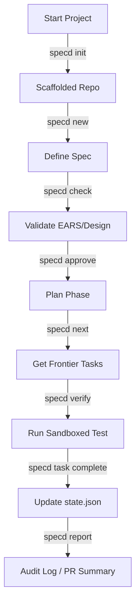

# Documentation Plan — specd Rebuild (v2)

This document outlines the analysis and execution plan for documenting the rebuilt version of `specd`. The goal is to provide developers and users with clear, organized, domain-specific documentation aligned with the **New SDLC with Vibe Coding** and the core product thesis: `Agent = Model + Harness`.

---

## 1. Context & Scope Triage Analysis

The rebuilt version of `specd` is a major streamlining effort, reducing complexity and footprint by discarding non-core features and focusing on deterministic process enforcement.

Key changes from the triaged surface (see [00-scope-triage.md](file:///var/www/html/rai/up/specd/fresh-start/00-scope-triage.md)):
- **Verbs reduced:** From **29 registered commands** down to **16 core verbs** (`init`, `new`, `check`, `approve`, `next`, `verify`, `task`, `status`, `context`, `decision`, `midreq`, `memory`, `report`, `handshake`, `mcp`, `brain`, `pinky`).
- **Dependencies minimized:** Stdlib-only. Cut Postgres/Redis backends.
- **Orchestration collapsed:** Folded multi-agent machinery into a single, clean `internal/orchestration` package.
- **Flywheel deferred:** Postponed complex feedback loops (`eval`, `review`, `deploy`, `observe`, `ingest`, `harness`), retaining only the `security` scan as a pluggable gate.

---

## 2. Organized Documentation Architecture

To prevent documentation sprawl and ensure developers can easily find domain details, the `docs/` directory will be structured with files matching the 12 system domains from the [fresh-start roadmap](file:///var/www/html/rai/up/specd/fresh-start/00-roadmap.md):

| Doc File | Target Domain | Key Topics Covered |
| :--- | :--- | :--- |
| [01-philosophy-charter.md](file:///var/www/html/rai/up/specd/docs/01-philosophy-charter.md) | `01-product-philosophy-core` | The Foundational Split, 8 Principles, and Harness Charter. |
| [02-spec-lifecycle-state.md](file:///var/www/html/rai/up/specd/docs/02-spec-lifecycle-state.md) | `02-spec-lifecycle-state` | State machine, phase transitions, directory layout, and `state.json`. |
| [03-validation-gates.md](file:///var/www/html/rai/up/specd/docs/03-validation-gates.md) | `03-validation-gates-engine` | The 7 Core Gates, opt-in/custom gates, and the pluggable gate interface. |
| [04-task-dag-waves.md](file:///var/www/html/rai/up/specd/docs/04-task-dag-waves.md) | `04-task-dag-wave-execution` | `tasks.md` Markdown parsing, DAG generation, wave execution frontier. |
| [05-evidence-verification.md](file:///var/www/html/rai/up/specd/docs/05-evidence-verification.md) | `05-evidence-verification` | Sandboxed test execution, `verify` command, and git-linked evidence ledger. |
| [06-agent-integration.md](file:///var/www/html/rai/up/specd/docs/06-agent-integration.md) | `06-agent-agnostic-integration` | Agent workflows, steering rules (constitution), and the `AGENTS.md` spec. |
| [07-mcp-surface.md](file:///var/www/html/rai/up/specd/docs/07-mcp-surface.md) | `07-mcp-handshake-surface` | MCP stdio JSON-RPC server and command/tool mappings. |
| [08-context-engineering.md](file:///var/www/html/rai/up/specd/docs/08-context-engineering.md) | `08-context-engineering` | Targeted token-budgeted manifests (`craftsman`, `validator`, `scout`, `scribe`). |
| [09-multi-agent-orchestration.md](file:///var/www/html/rai/up/specd/docs/09-multi-agent-orchestration.md) | `09-orchestration-brain-pinky` | Multi-agent coordination (Brain/Pinky), leases, concurrency, checkpoints. |
| [10-cli-foundations.md](file:///var/www/html/rai/up/specd/docs/10-cli-foundations.md) | `10-cli-architecture-foundations` | CLI args routing, file locks, atomic writes, CAS, and YAML config loader. |
| [11-reporting-observability.md](file:///var/www/html/rai/up/specd/docs/11-reporting-observability.md) | `11-reporting-observability` | CLI status, markdown/HTML generation, telemetry ledger, and history replay. |
| [12-deferred-flywheel-security.md](file:///var/www/html/rai/up/specd/docs/12-deferred-flywheel-security.md) | `12-flywheel-triage-tier` | Re-entry contracts, evidence schemas, and pluggable security gate. |

---

## 3. Core Concepts Developers Must Understand

Documentation must clearly define these core concepts to enforce proper mental models when developing on or using `specd`:

### Concept A: The Foundational Split (P1)
- **Concept:** The Agent reasons and creates (specs, design, code). The Harness (`specd`) enforces process rules, manages files, runs gates, and registers verification.
- **Why it matters:** Prevents LLM non-determinism from leaking into state management. The harness never invokes LLMs for routing or gates.

### Concept B: Evidence-Gated Completion (P3)
- **Concept:** No task can transition to `complete` without a verifiable trace (`verify` command execution yielding exit code `0` on the exact git `HEAD`).
- **Why it matters:** Ensures codebase integrity and prevents agents from claiming success without executing verification scripts.

### Concept C: Task DAG & Wave Frontiers (P4)
- **Concept:** Tasks declared in `tasks.md` form a Directed Acyclic Graph (DAG). The harness computes the "frontier" of tasks (runnable now because all dependencies are resolved).
- **Why it matters:** Unlocks safe concurrent execution of tasks by multiple agents.

### Concept D: Context Budgeting (P8)
- **Concept:** Minimizing the context fed to the model by mapping role-specific manifests (e.g. `craftsman` receives target files + task, `validator` receives verification scripts + diff).
- **Why it matters:** Preserves context space, reduces costs, and focuses the model on single-task actions.

### Concept E: Conductor vs. Orchestrator Modes
- **Concept:** 
  - **`simple` mode (Conductor):** Single agent works in real-time, human-in-the-loop approves phase gates.
  - **`orchestrated` mode (Orchestrator):** Multi-agent async delegation (Brain/Pinky).

---

## 4. Key Use Cases & Feature Mapping

Documentation will map CLI features directly to real-world workflows:

### Use Case 1: Iterative Single-Agent Implementation (`simple` mode)
1. **Developer / Agent** scaffolds spec: `specd new feature-x`.
2. Agent writes requirements and design.
3. System checks criteria: `specd check feature-x` (verifies EARS/Design).
4. Human transitions spec to planning: `specd approve feature-x`.
5. Agent drafts `tasks.md`. Once approved via `specd approve feature-x`, execution begins.
6. Agent queries next task: `specd next feature-x`.
7. Agent implements, verifies: `specd verify feature-x --task T1.1`.
8. Task completes: `specd task complete feature-x --task T1.1`.

### Use Case 2: Async Multi-Agent Delegation (`orchestrated` mode)
1. User configures orchestration: `orchestration.enabled: true` in config.
2. User spawns Brain controller: `specd brain start feature-x`.
3. Brain parses DAG, locks specs, and dispatches ready tasks to Pinky worker agents.
4. Workers claim tasks: `specd pinky claim --task T1.1`.
5. Workers run tests, upload check-pointed state: `specd pinky checkpoint`.
6. Once all tasks complete, Brain prepares release: `specd brain approve`.

### Use Case 3: Continuous Integration (CI) Enforcement
1. Pull Request triggers CI action.
2. CI installs `specd` static binary.
3. Action runs validation: `specd check --all`.
4. Gates block merge if `tasks.md` doesn't match `state.json` (Sync gate) or requirements are missing (Traceability gate).

---

## 5. Action Plan

To avoid stale documentation and ensure 100% accuracy during implementation:

1. **Step 1: Write Core Philosophy & Foundations**
   - Write [01-philosophy-charter.md](file:///var/www/html/rai/up/specd/docs/01-philosophy-charter.md) and [10-cli-foundations.md](file:///var/www/html/rai/up/specd/docs/10-cli-foundations.md).
   - *Target:* Align team on zero-dep rules and harness/agent split.

2. **Step 2: Document Spec Lifecycle & Parser**
   - Write [02-spec-lifecycle-state.md](file:///var/www/html/rai/up/specd/docs/02-spec-lifecycle-state.md) and [04-task-dag-waves.md](file:///var/www/html/rai/up/specd/docs/04-task-dag-waves.md).
   - *Target:* Document the exact structure of `state.json` and markdown checkboxes.

3. **Step 3: Document Gates & Verification**
   - Write [03-validation-gates.md](file:///var/www/html/rai/up/specd/docs/03-validation-gates.md) and [05-evidence-verification.md](file:///var/www/html/rai/up/specd/docs/05-evidence-verification.md).
   - *Target:* Detail EARS criteria syntax and verification sandbox configuration (`bwrap`).

4. **Step 4: Document Integrations (MCP & Context)**
   - Write [06-agent-integration.md](file:///var/www/html/rai/up/specd/docs/06-agent-integration.md), [07-mcp-surface.md](file:///var/www/html/rai/up/specd/docs/07-mcp-surface.md), and [08-context-engineering.md](file:///var/www/html/rai/up/specd/docs/08-context-engineering.md).
   - *Target:* Provide integration guides for IDE agents (Claude Code, Cursor) and custom MCP clients.

5. **Step 5: Document Orchestration & Flywheel Seams**
   - Write [09-multi-agent-orchestration.md](file:///var/www/html/rai/up/specd/docs/09-multi-agent-orchestration.md), [11-reporting-observability.md](file:///var/www/html/rai/up/specd/docs/11-reporting-observability.md), and [12-deferred-flywheel-security.md](file:///var/www/html/rai/up/specd/docs/12-deferred-flywheel-security.md).
   - *Target:* Close loop with multi-agent orchestration setup and future extension points.
