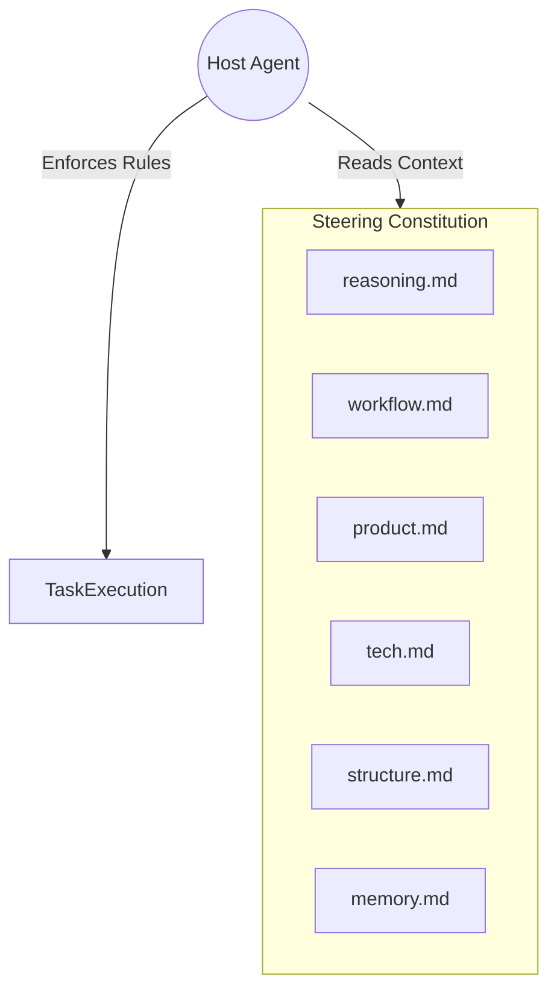

# specd Agent Integration Guide

`specd` is designed to be **agent-agnostic**. It aligns host coding agents (such as Claude Code, Cursor, Aider, or custom wrappers) to follow the spec-driven workflow through:
1. An **agents instruction file** (`AGENTS.md`) at the project root.
2. A directory of **steering constitutions** (`.specd/steering/`) that guide high-level decisions.
3. A set of **role-play prompts** (`.specd/roles/`) that restrict the agent's actions during execution.
4. **Context Engineering** primitives (`specd context`) that control what data enters the agent's context window.

---

## 1. The Two `AGENTS.md` Files

It is critical to distinguish between the two `AGENTS.md` files in the `specd` ecosystem:

### Root `AGENTS.md` (specd Contributor Guide)
*   **Location**: Root of the `specd` CLI repository itself.
*   **Purpose**: Instructs AI agents who are **developing the specd tool itself**. It explains how to build the TypeScript files, run the 92 core tests, write validation gates, and follow the CLI schema migrations.

### Template `src/templates/AGENTS.md` (Target Project Guide)
*   **Location**: Found inside `src/templates/AGENTS.md` in the CLI repo. When a user runs `specd init`, this file is written to the root of the **target repository** as `AGENTS.md`.
*   **Purpose**: Instructs the agent working on the **target project** how to use the `specd` CLI. It details the six-phase spec process and mandates that the agent must only update task states via the `specd` CLI command interface.

---

## 2. Steering Configuration (`.specd/steering/`)

The steering files act as the **constitution** for the agent. They outlive any individual chat session and define the rules and boundaries of the project.



### Steering Document Purposes:
1.  **`reasoning.md`**: Defines the six-phase thinking discipline (Analyze, Plan, Execute, Verify, Reflect) and the **backpropagation protocol** (when a test fails, update the invariants first).
2.  **`workflow.md`**: Outlines the spec lifecycle transitions and the validation gates that must be satisfied before moving between phases.
3.  **`product.md`**: Documents the domain rules, target audience, business constraints, and core product assumptions.
4.  **`tech.md`**: Outlines the approved technology stack, languages, dependency constraints, and testing frameworks.
5.  **`structure.md`**: Defines file organization conventions, directory structures, and module boundaries.
6.  **`memory.md`**: Holds promoted learnings and conventions compiled across multiple past specifications to avoid repeating mistakes.

---

## 3. Role Personas (`.specd/roles/`)

During the `executing` phase, tasks are assigned to specific roles in `tasks.md`. The agent must swap its active persona to match the task's assigned role.

| Role Persona | Permissions | Rules & Responsibilities |
|---|---|---|
| 🔍 **`investigator`** | **Read-only** | Explores code, traces execution paths, and finds integration points. Cannot edit files. Reports findings with exact file and line references. |
| 🛠️ **`builder`** | **Write-only** | Implements the task contract. Modifies only the designated files and their corresponding test files. Runs the task verify command. |
| 🧪 **`verifier`** | **Read-only** | Runs tests independently to collect execution logs. Cannot modify code. Captures output as evidence. |
| 🛡️ **`reviewer`** | **Read-only** | Performs code audits on git diffs. Logs issues with severity tags (`critical`, `high`, `medium`, `low`) and specifies the exact location and recommended fix. |

---

## 4. Subagent Coordination Modes

The configuration file `.specd/config.json` defines how roles are executed via the `roles.subagentMode` tunable:

### 1. `inline` Mode (Default)
The host agent performs the work itself, manually swapping its persona context inline when starting a task.
*   **Pros**: Simple, works with any agent interface.
*   **Cons**: The agent must maintain the full chat history, leading to potential context bloat.

### 2. `delegate` Mode
If the host agent supports spawning subagents (e.g. Claude Code's `invoke_subagent` or multi-agent CLI harnesses), it delegates tasks to specialized subagents configured with the specific role prompts in `.specd/roles/`.
*   **Pros**: Completely isolates implementation context. A builder subagent has no access to irrelevant codebase files, reducing token consumption.
*   **Cons**: Requires a host agent with agent-spawning capabilities.

---

## 5. Context Engineering: `specd context`

A major cause of AI agent failure is **context pollution** — loading too many files, leading to confusion, hallucinated imports, or exceeding token limits.

`specd` solves this with the `specd context <slug>` command. The agent runs this command at the beginning of each turn:

```sh
node /path/to/specd/dist/cli.js context my-feature
```

### Context Output Structure
The output is divided into three sections:
1.  **Phase Briefing**: Reminds the agent of the active phase rules (e.g. "You are in the PLAN phase. Do not edit code files outside `.specd/`").
2.  **Load List**: A minimal, absolute list of files the agent should load into its context window (e.g. only the active task details, the design document, and the steering files).
3.  **Signals (Active System Notifications)**:
    *   **Blockers**: Lists any tasks currently blocked and their reasons.
    *   **Awaiting Approval**: Notifies if a mid-requirements change has locked the spec.
    *   **Uncovered Requirements**: Lists any requirements that have no tasks mapping to them during verification.
