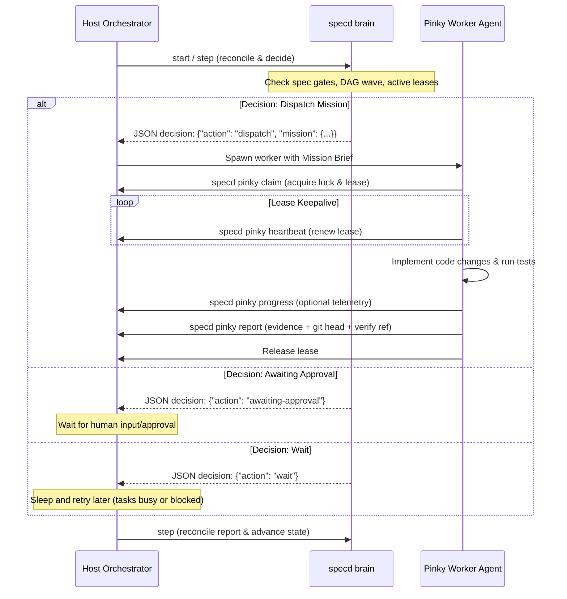

# Agent Integration

Wiring a coding agent (Claude Code, Cursor, Aider, or any command-running wrapper)
to drive the `specd` workflow.

## Contents

1. [The two AGENTS.md files](#the-two-agentsmd-files)
2. [Steering constitution](#steering-constitution)
3. [Role personas](#role-personas)
4. [Subagent coordination modes](#subagent-coordination-modes)
5. [Context engineering](#context-engineering)
6. [Brain/Pinky orchestration](#brainpinky-orchestration)
7. [Cross-spec programs](#cross-spec-programs)

---

## The two AGENTS.md files

| File | Location | Purpose |
|---|---|---|
| **Root AGENTS.md** | `0xkhdr/specd` repo root | Guide for agents **developing specd itself** |
| **Template AGENTS.md** | `internal/core/embed_templates/AGENTS.md` | Guide written to **user repos** by `specd init` |

## Steering constitution

Durable rules under `.specd/steering/` that outlive individual chat sessions:

| File | Purpose |
|---|---|
| `reasoning.md` | Six-phase thinking discipline + backpropagation protocol |
| `workflow.md` | Spec lifecycle transitions + validation gates |
| `product.md` | Domain rules, target audience, business constraints |
| `tech.md` | Approved stack, languages, dependencies, testing frameworks |
| `structure.md` | File organization, directory structures, module boundaries |
| `memory.md` | Promoted learnings across specs |

`product.md`, `structure.md`, and `tech.md` are authored by the agent itself,
guided by the `specd-steering` skill (see the [User Guide](./user-guide.md#bootstrap-project-context-recommended)).

## Role personas

Prompts under `.specd/roles/`. Each task's `role:` key binds it to one persona.

| Role | Permissions | Responsibilities |
|---|---|---|
| 🔍 `investigator` | Read-only | Explore code, trace paths, find integration points. Reports exact file/line refs. |
| 🛠️ `builder` | Write | Implement the task contract. Modifies designated files + tests. Runs verify. |
| 🧪 `verifier` | Read-only | Runs tests independently. Captures output as evidence. |
| 🛡️ `reviewer` | Read-only | Audits git diffs. Logs issues with severity tags + exact locations. |

## Subagent coordination modes

Set in `.specd/config.json` via `roles.subagentMode`:

### `inline` mode (default)
- The host agent performs the work, swapping persona context inline.
- **Pros:** Simple; works with any agent.
- **Cons:** Context bloat from full chat history.

### `delegate` mode
- The host spawns specialized subagents per role.
- **Pros:** Isolated context, reduced token consumption.
- **Cons:** Requires agent-spawning capabilities (Claude Code, etc.).

### Frontier dispatch

`specd dispatch <slug> --json` emits one ready-to-run packet per task in the
current frontier — role prompt, contract, files, acceptance, verify command, and
the completion command. Pattern for parallel execution:

```bash
# 1. Get dispatch packets
specd dispatch my-feature --json

# 2. For each packet, spawn a subagent with its rolePrompt + contract.
# 3. Each subagent:
#      ... implement task ...
#      specd verify my-feature T1
#      specd task my-feature T1 --status complete
# 4. The orchestrator monitors the frontier and dispatches the next wave.
```

## Context engineering

`specd context <slug>` controls what enters the agent's context window:

```bash
specd context my-feature
```

Output sections:
1. **Phase briefing** — active phase rules (e.g. "You are in PLAN phase. Do not edit code.").
2. **Load list** — the minimal file list for the context window.
3. **Signals**
   - Blockers: currently blocked tasks + reasons
   - Awaiting approval: mid-req change locks
   - Uncovered requirements: requirements with no task mappings

---

## Brain/Pinky Orchestration

The **Brain & Pinky model** is `specd`'s native multi-agent orchestration architecture. It transforms the harness from a passive command-line validator into an active, autonomous coordinator.

Unlike traditional orchestration stacks, `specd` separates concerns into two layers:
1. **The Brain (Deterministic Controller):** A state machine that analyzes the current spec state (requirements, design, task DAG progress) and makes decisions (e.g., "dispatch builder for T1", "await human approval for planning"). **The Brain never calls an LLM and never executes unsafe code directly.**
2. **Pinky (Ephemeral Execution Workers):** Independent AI agents spawned by your application or host environment. They receive a structured **Mission** from the Brain, claim a temporary filesystem lease, perform the work (using specialized role personas), run the verification tests, and write back evidence.

---

### Architectural Design & Sequence Flow

The interaction between the Host Orchestrator, the `specd` Brain, and Pinky workers is fully file-backed via the **ACP (Agent Communication Protocol)**.



---

### Step-by-Step Developer Walkthrough

To build your own custom orchestration harness or integrate `specd` into your product, follow this integration workflow.

#### Step 1: Enable Orchestration in configuration
Enable orchestration during project initialization:
```bash
specd init --orchestration planning --orchestration-workers 4
```
This writes the configuration blocks into `.specd/config.json`:
```json
"orchestration": {
  "enabled": true,
  "approvalPolicy": "planning",
  "workerMode": "host",
  "maxWorkers": 4,
  "maxRetries": 2,
  "sessionTimeoutMinutes": 120,
  "hostReportedCostLimitUSD": 10.00,
  "transport": {
    "kind": "file",
    "pollIntervalMillis": 500,
    "messageTTLSeconds": 3600,
    "leaseSeconds": 120,
    "heartbeatSeconds": 30
  }
}
```

#### Step 2: Start a spec session
Initiate an orchestration session for a given spec. This generates a unique `session` UUID:
```bash
specd brain start my-feature --approval-policy planning --max-workers 4 --max-retries 2 --timeout-seconds 7200 --json
```

#### Step 3: Run the Polling & Step Loop
Re-invoke the Brain's stepping handler to reconcile the filesystem database, check worker lease timeouts, and request the next decision:
```bash
specd brain step my-feature --session <session-id> --approval-policy planning --max-workers 4 --max-retries 2 --timeout-seconds 7200 --json
```
The Brain will output a structured JSON response detailing the latest decision:
```json
{
  "action": "dispatch",
  "reason": "task T1 is runnable and has no active lease",
  "mission": {
    "sessionID": "uuid-session-123",
    "workerID": "w-T1-attempt-1",
    "spec": "my-feature",
    "taskID": "T1",
    "role": "builder",
    "deadline": "2026-06-20T17:30:00Z",
    "files": ["src/login.go", "src/login_test.go"],
    "verifyCommand": "go test ./src -run TestLogin"
  }
}
```

#### Step 4: Ephemeral Worker Execution (The Pinky Lifecycle)
When the host sees a `dispatch` decision, it spins up an AI worker (e.g. Claude Code or an internal script) and instructs it to drive the Pinky protocol:

1. **Claim the Mission:**
   The worker starts by claiming the mission to lock in its lease and prevent other workers from taking it:
   ```bash
   specd pinky claim --mission mission.json
   ```
2. **Keep the Lease Alive:**
   While doing creative work, the host must periodically send heartbeats before the `leaseSeconds` deadline expires, otherwise the Brain will reclaim and reassign the task:
   ```bash
   specd pinky heartbeat --session <session-id> --worker <worker-id> --attempt 1
   ```
3. **Emit Progress (Optional):**
   Send telemetry updates back to the orchestrator:
   ```bash
   specd pinky progress --session <session-id> --worker <worker-id> --spec my-feature --task T1 --attempt 1 --percent 50 --message "Implementing OAuth login handler"
   ```
4. **Mid-task Queries & Directives:**
   If the worker encounters a design ambiguity, it can ask a question:
   ```bash
   specd pinky query --session <session-id> --worker <worker-id> --spec my-feature --task T1 --attempt 1 --text "Should we support Google OAuth?"
   ```
   The Brain halts progress at the next safe boundary and asks the host/user for input, which is written back as a directive:
   ```bash
   specd brain directive --session <session-id> --worker <worker-id> --spec my-feature --task T1 --attempt 1 --action continue --reason "Yes, google oauth only" --in-reply-to <message-id>
   ```
5. **Run Verification & Report Completion:**
   Before marking a task complete, the worker **must** run the verification command to get a passing record in the local ledger:
   ```bash
   specd verify my-feature T1
   ```
   It then writes the final terminal report, citing the verification reference:
   ```bash
   specd pinky report --session <session-id> --worker <worker-id> --spec my-feature --task T1 --attempt 1 --verification-ref "verify-rec-456" --summary "OAuth integration finished and tests pass" --git-head "abc123sha" --changed-files "src/login.go,src/login_test.go" --duration-ms 45000 --host-tokens 8500 --host-cost 0.12
   ```

---

### Reference Implementation: Custom Python Orchestrator

Below is a clean, dependency-free reference implementation of a host loop driving the `specd` Brain and spawning Pinky worker agents.

```python
import subprocess
import json
import time
import os

def run_specd(cmd_args):
    """Utility to call specd and return parsed JSON."""
    result = subprocess.run(
        ["specd"] + cmd_args + ["--json"],
        capture_output=True, text=True
    )
    if result.returncode != 0:
        raise RuntimeError(f"specd failed: {result.stderr}")
    return json.loads(result.stdout)

def orchestrate_spec(spec_slug):
    # 1. Start session
    print(f"Starting orchestration session for {spec_slug}...")
    session_data = run_specd([
        "brain", "start", spec_slug,
        "--approval-policy", "planning",
        "--max-workers", "2",
        "--max-retries", "1",
        "--timeout-seconds", "3600"
    ])
    session_id = session_data["sessionID"]
    
    # 2. Main Step-Sense Loop
    while True:
        # Ask Brain what to do next
        step_data = run_specd([
            "brain", "step", spec_slug,
            "--session", session_id,
            "--approval-policy", "planning",
            "--max-workers", "2",
            "--max-retries", "1",
            "--timeout-seconds", "3600"
        ])
        
        action = step_data.get("action")
        print(f"Brain Decision: {action} - {step_data.get('reason')}")
        
        if action == "complete-session":
            print("Orchestration complete!")
            break
            
        elif action == "escalate" or action == "policy-violation":
            print(f"Orchestration blocked! Reason: {step_data.get('reason')}")
            break
            
        elif action == "dispatch":
            # Extract mission details
            mission = step_data["mission"]
            execute_pinky_worker(mission)
            
        elif action == "wait":
            # Sleep briefly and poll again
            time.sleep(2)

def execute_pinky_worker(mission):
    print(f"Spawning Pinky for task {mission['taskID']} ({mission['role']})")
    
    # Save mission to temp file for claim
    with open("temp_mission.json", "w") as f:
        json.dump(mission, f)
        
    try:
        # Worker claims the mission
        run_specd(["pinky", "claim", "--mission", "temp_mission.json"])
        
        # Simulate creative agent work...
        print("Worker is editing code files...")
        time.sleep(5) 
        
        # Run verification tests
        subprocess.run(["specd", "verify", mission["spec"], mission["taskID"]], check=True)
        
        # Report completion back to Pinky ledger
        run_specd([
            "pinky", "report",
            "--session", mission["sessionID"],
            "--worker", mission["workerID"],
            "--spec", mission["spec"],
            "--task", mission["taskID"],
            "--attempt", "1",
            "--verification-ref", f"verify-{mission['taskID']}",
            "--summary", f"Successfully completed {mission['taskID']}",
            "--changed-files", ",".join(mission.get("files", []))
        ])
        print("Worker successfully completed mission and reported evidence.")
    finally:
        if os.path.exists("temp_mission.json"):
            os.remove("temp_mission.json")

if __name__ == "__main__":
    orchestrate_spec("my-feature")
```

---

### The Built-in Driver Loop (`brain run`)

If you do not want to implement a custom orchestration loop, `specd` includes a built-in driver command `specd brain run` that automates step-sense polling and worker spawns:

```bash
specd brain run my-feature --worker-cmd 'python3 my_agent.py'
```

When using `specd brain run`:
- The harness manages step polling, timeouts, lease reclaims, and DAG wave progression.
- `--worker-cmd` is invoked per dispatch. It receives the temporary mission JSON path via the `SPECD_MISSION` environment variable, along with context environment variables (`SPECD_SESSION`, `SPECD_WORKER`, `SPECD_SPEC`, `SPECD_TASK`, `SPECD_ROLE`).
- A hung or runaway worker is automatically terminated when the mission deadline is reached, thanks to process group isolation.

---

### Trust Boundary & Safety Invariants

Orchestrator clients must respect the following security invariants enforced by the harness:

- **Advisory Cost & Time Brakes:** While host-reported cost is untrusted telemetry, the Brain sums `host-cost` across all session reports. If the sum exceeds `hostReportedCostLimitUSD` (when `> 0`), the Brain halts and escalates with a `policy-violation` to prevent runaway LLM costs.
- **Evidence Integrity:** A Pinky report is only accepted by the Brain if it matches a passing `specd verify` run recorded in the spec database. A worker cannot bypass validation by reporting success without running the task's tests.
- **Lease Expiry:** If a worker stops heartbeating or crashes, its lease is automatically reclaimed by the Brain after `leaseSeconds` and rescheduled (up to `maxRetries`), ensuring temporary network failures do not stall development.
- **Cooperative Cancellation:** `specd brain cancel` does not forcibly terminate processes on the host. Instead, it records cancellation intent in the database. Workers must poll `specd pinky inbox` or check command exits to stop themselves cleanly.

---

## Driving Brain/Pinky from MCP Hosts

MCP hosts have two layers. Prefer the **intent-level tools** for orchestration;
drop to the raw passthrough only when you need a flag the intent tools do not
surface.

**Intent-level tools (recommended).** Six semantic tools wrap the deterministic
primitives with sane policy defaults — one clear affordance per intent, no flag
plumbing. They add no new core authority; each translates to a `specd_brain`/
`approve` invocation the passthrough could already produce.

| Tool | Wraps | Key arguments |
|---|---|---|
| `brain_orchestrate` | `brain run` | `spec` (required), `goal`, `worker_cmd`, `approval_policy` (default `planning`), `max_steps`, `session`, `no_bootstrap` |
| `brain_status` | `brain status` | `session` (required), `program` |
| `brain_approve` | `approve` | `spec` (required) |
| `brain_pause` / `brain_resume` / `brain_cancel` | `brain pause`/`resume`/`cancel` | `session` (required), `program` |

`brain_orchestrate` bootstraps a missing spec (using `goal` as its title), then
runs the Brain loop to completion under the planning policy. Supply `worker_cmd`
to execute Pinky dispatches; without one the loop stops at the first dispatch so
the host can run the worker itself. Start-and-monitor is one tool call carrying a
goal + spec — no `--approval-policy`/`--max-workers`/… plumbing.

**Raw passthrough (power users).** The generated `specd_brain` and `specd_pinky`
tools remain. The `args` array is the normal CLI subcommand list; flags are
ordinary tool arguments.

Typical raw host loop:

1. Call `specd_brain` with `args: ["start", "<slug>"]` and explicit
   `approval-policy`, `max-workers`, `max-retries`, and `timeout-seconds`.
2. Read the bounded JSON result. If Brain dispatches a mission, the host starts
   or assigns its own worker; specd does not spawn one.
3. The worker calls `specd_pinky` with `args: ["claim"]`, then heartbeat,
   progress/block, and terminal report calls while holding the lease.
4. The worker runs the task's `specd verify` command through the host shell.
5. The worker reports completion with `specd_pinky args: ["report"]` and the
   matching `verification-ref`; Brain later steps and reconciles the event log.
6. The host repeats bounded `specd_brain status` / `step` calls until the
   session completes, pauses, escalates, or waits for human approval.

### Beginning-to-delivery: authoring frontier, `brain run`, and worker briefs

Brain drives both **planning** and **execution**, not just execution:

- **Authoring frontier.** When a spec is in `requirements`, `design`, or `tasks`
  and the phase artifact is missing or fails its gate, Brain emits a
  `dispatch-authoring` decision (a mission to author that artifact, verified by
  `specd check`). Under `planning`/`session` approval policy it dispatches and,
  once the gate passes, emits `advance-phase` to ratchet to the next status —
  the same gate `specd approve` enforces. Under `manual` it requests human
  approval instead. Execution tasks never run before the `tasks → executing`
  gate clears.

- **Worker briefs and agent templates.** `specd pinky brief --session <id>
  --worker <id> --spec <slug> (--task <id> | --artifact <name>) [--json]` renders
  a paste-ready, context-engineered worker brief (or, with `--json`, the
  claimable mission). Each mission carries a deterministic `contextManifest`:
  required role + Pinky skill + one phase-scoped skill + `specd context` + scoped
  files, optional source artifacts, and a soft token ceiling so different hosts
  package the same minimal sufficient context. `specd init` installs Claude Code
  sub-agent definitions at `.claude/agents/pinky-{builder,investigator,reviewer,verifier}.md`, each a thin
  shell that follows the manifest and runs claim → execute → verify → report.

The core stays deterministic: the driver loop and briefs are orchestration glue;
all authoring/execution happens inside the host worker. The final
`verifying → complete` transition still requires the acceptance-evidence gate and
is never auto-cleared.

Mid-task clarification is explicit: a leased worker may send `specd pinky query --text "..."`
and keep working only up to the next safe waiting point. Brain or the host replies with
`specd brain directive ... --in-reply-to <query-message-id>`, and workers poll
`specd pinky inbox` for directives. This avoids full blocker escalation for bounded questions
while preserving the file-backed ACP audit trail.

Cancellation is cooperative: `specd_brain cancel` records intent, and a later
step emits cancellation directives for active leases. Hosts must deliver that
signal to their workers and stop them safely; specd never kills provider or
editor processes.

Recovery is file-backed: after a host or MCP restart, call `specd_brain status`
for the persisted session and continue with `step`. Expired leases are reclaimed
by Brain within policy, and duplicate Pinky terminal reports are idempotent.

## Cross-spec programs

For multi-spec efforts, declare dependencies between whole specs:

```bash
specd program link api --on auth     # 'api' waits for 'auth'
specd program unlink api --on auth   # remove the dependency
specd program                        # view the program-level DAG
specd program --json                 # JSON output for orchestrators
```

Edges are stored in `.specd/program.json`. Self-edges and cycles are rejected.

```
┌─────────┐     ┌─────────┐     ┌─────────┐
│  auth   │────►│  api    │────►│  web    │
│ (Wave 1)│     │ (Wave 2)│     │ (Wave 3)│
└─────────┘     └─────────┘     └─────────┘
```

`specd program status` resolves which whole specs are runnable — the cross-spec
analog of `specd next`.
