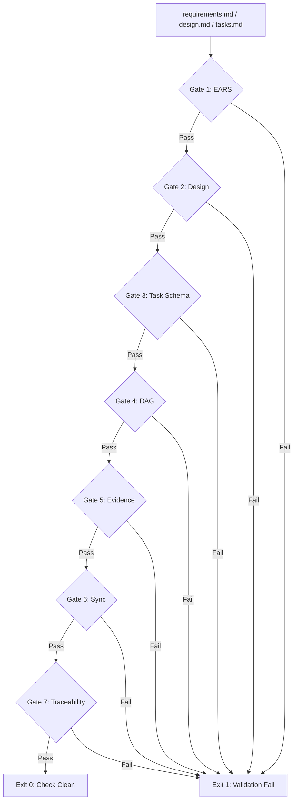
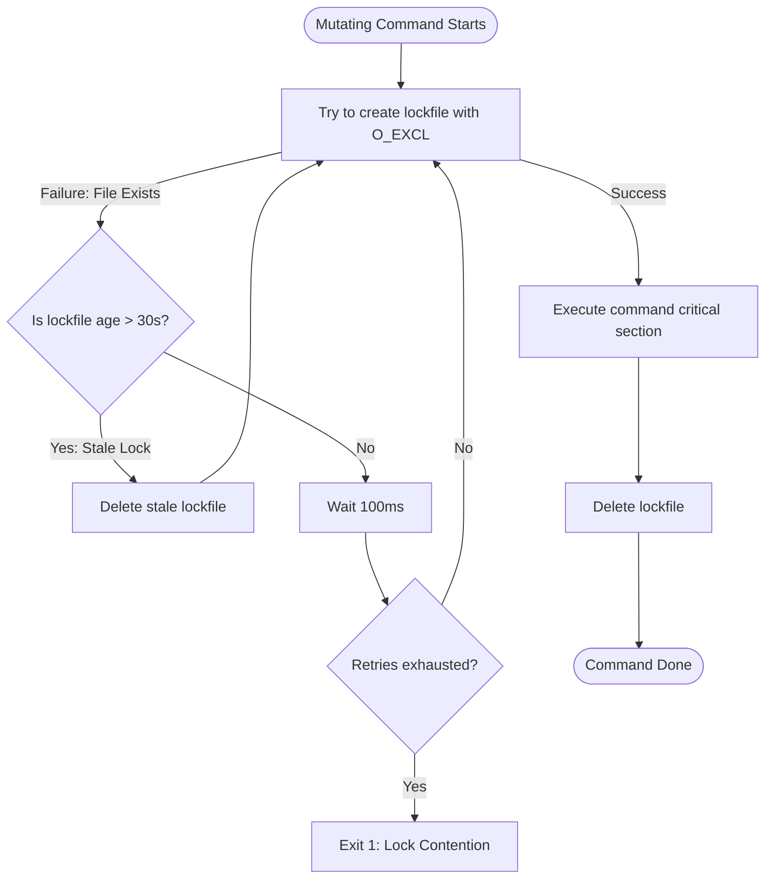

# specd Contributor Guide

This guide is for developers and AI agents contributing to the development of the `specd` tool itself. It details the internal codebase structure, custom parsing engines, concurrency safeguards, and instructions on how to extend the harness.

---

## 1. Codebase Directory Walkthrough

```
src/
├── cli.ts               # CLI Router: Parses arguments, registers dispatch table, handles exits
├── commands/            # Command Handlers (one file per command)
│   ├── init.ts          # Scaffolds configuration, role prompts, steering, and AGENTS.md
│   ├── new.ts           # Initializes a new spec folder structure
│   ├── status.ts        # Renders the current spec state and status graphs
│   ├── context.ts       # Generates minimal loading lists and signal warnings for agents
│   ├── check.ts         # Coordinates execution of the 7 validation gates
│   ├── next.ts          # Computes and displays the next runnable task(s)
│   ├── task.ts          # Evidence-gated task status updates (dual-writes markdown/state)
│   ├── approve.ts       # Planning ratchet coordinator
│   ├── decision.ts      # Appends ADRs (Architectural Decision Records)
│   ├── midreq.ts        # Appends mid-requirements feedback logs
│   ├── memory.ts        # Appends and promotes local/global learnings
│   ├── report.ts        # Compiles snapshot markdown/HTML status reports
│   └── waves.ts         # Prints DAG waves and critical path analysis
└── core/                # Core engines
    ├── paths.ts         # Traverses directories up from CWD to find .specd/ root
    ├── io.ts            # Atomic write and O_APPEND implementations
    ├── lock.ts          # Reentrant file-based advisory locking
    ├── state.ts         # state.json schemas, CAS revision checks, and schema migrations
    ├── phases.ts        # Phase transitions, status mapping, and Design checklist
    ├── tasksParser.ts   # Custom tasks.md markdown parser/serializer
    ├── dag.ts           # DAG construction, wave sorting, and cycle detection
    ├── ears.ts          # Regex-based EARS grammar matcher
    ├── report.ts        # Deterministic MD/HTML report compiler
    ├── specFiles.ts     # Accessor for spec folders; reconciles markdown to state.json
    ├── render.ts        # Renders text-based wave graphs
    ├── templates.ts     # Scaffolding template loader
    └── exit.ts          # SpecdError definitions and exit code constants
```

---

## 2. Validation Gate Pipeline

The validation pipeline runs sequentially during `specd check` and is enforced at phase boundaries when running `specd approve`.



### The 7 Validation Gates:
1.  **EARS Gate** (`ears.ts`): Parses `requirements.md` using regex to guarantee that every requirement contains a user story and that all acceptance criteria match EARS grammar.
2.  **Design Gate** (`phases.ts`): Checks `design.md` to confirm the presence of all 7 mandatory headers and validates that they contain non-empty contents free of `TODO` placeholders.
3.  **Task-Schema Gate** (`tasksParser.ts`): Asserts that all task blocks in `tasks.md` contain the 7 mandatory keys, and that builder/verifier tasks do not have `verify: N/A`.
4.  **DAG Gate** (`dag.ts`): Checks the task dependency graph for cycles, orphan dependencies, or wave violations.
5.  **Evidence Gate** (`task.ts`): Verifies that no task status is marked `complete` in `state.json` without matching non-empty evidence.
6.  **Sync Gate** (`specFiles.ts`): Confirms that markdown checkbox statuses (`[ ]`, `[/]`, `[x]`, `[!]`) in `tasks.md` match task statuses in `state.json`.
7.  **Traceability Gate** (`specFiles.ts`): Ensures every requirement ID listed in `tasks.md` exists in `requirements.md`. Outputs a warning if a requirement has no associated tasks (a coverage gap).

---

## 3. Concurrency & Durability Model

To support concurrent developer operations (such as multiple builders executing different frontier tasks at the same time), `specd` implements a multi-tier concurrency and safety model.

### 1. Advisory Lock (`lock.ts`)
A lock is acquired prior to any mutating operation (`task`, `approve`, `midreq`, etc.) using a directory-level lockfile `.specd/specs/<slug>/.lock`.



### 2. Revision Checks (CAS)
Every read of `state.json` caches the `revision` number in memory. When saving, the CLI performs a Compare-And-Swap check. If the revision number on disk has changed, the write aborts with an exit code of `1` to prevent clobbering concurrent updates.

### 3. Atomic File Writes
To prevent file corruption during OS crashes or termination interrupts, the `atomicWrite` method in `src/core/io.ts` implements this pattern:
1. Writes the content to a temporary file (`.tasks.md.tmp` or `.state.json.tmp`) in the same directory.
2. Synchronizes the write buffer to disk using `fsync`.
3. Renames the temporary file over the target file using `rename` (atomic on POSIX systems).

### 4. Atomic Ledger Appends
Documents like `decisions.md` (ADRs), `mid-requirements.md` (feedback log), and `memory.md` append records directly to file descriptors opened with the OS `O_APPEND` flag. This ensures that concurrent write requests are serialized and appended cleanly without interleaving or truncation.

---

## 4. Parser Internals: `tasksParser.ts`

`specd` avoids Markdown AST libraries to remain dependency-free and prevent modifying formatting, white spaces, or comments during serialization.

The `tasksParser.ts` engine is a line-by-line state machine:
*   **Parsing**: Walks lines to find Wave headers (`## Wave N`) and tasks (`- [ ] TID — title`). When a task is matched, it parses the subsequent indented keys (e.g. `  - key: value`).
*   **Annotations**: Evidence and blocker annotations are parsed from HTML comments immediately following a task declaration (e.g. `<!-- verified: ... -->`).
*   **Serialization**: Rebuilds the document line-by-line. It guarantees **round-trip byte-stability**: parsing a file and writing it back out must yield identical bytes.

---

## 5. Extending the CLI

### How to Add a CLI Command
1.  **Create Command File**: Create `src/commands/my-command.ts`. Export a handler function:
    ```typescript
    import { findSpecdRoot, requireSpecdRoot } from "../core/paths.js";
    import { SpecdError } from "../core/exit.js";

    export async function myCommand(slug: string, options: { json?: boolean }): Promise<number> {
      const root = requireSpecdRoot();
      // Implementation
      return 0; // Return exit code
    }
    ```
2.  **Register Router**: Register your command in `src/cli.ts` within the main `switch (cmd)` block, parse parameters, and catch errors.
3.  **Update Usage Info**: Add your command and its options to the `USAGE` help string in `src/cli.ts`.
4.  **Add Tests**: Create unit/integration tests in `test/` (e.g., `test/my-command.test.ts`) and ensure it is included in `test` scripts.

### How to Add/Modify a Validation Gate
1.  **Define Check Logic**: Write the validation logic in a core file (e.g., `src/core/ears.ts` for requirement checks, or directly in `src/commands/check.ts` for structural validations).
2.  **Add to check command**: In `src/commands/check.ts`, execute your validation. Append failures to the result array:
    ```typescript
    // Example addition
    if (failsCheck) {
      results.push({ gate: "my-gate", severity: "fail", message: "Check failed!" });
    }
    ```
3.  **Update Planning Ratchet**: If the validation must block phase advancement, ensure the gate check is queried inside the transition logic in `src/commands/approve.ts`.
4.  **Add Test Fixture**: Update `test/check.test.ts` to assert that your gate correctly flags violations and exits with code `1`.

### How to Modify `state.json` Schema
1.  **Update Schema Interface**: Edit the `State` interface in `src/core/state.ts` to add or modify properties.
2.  **Increment Schema Version**: Increment `SCHEMA_VERSION` in `src/core/state.ts`.
3.  **Write Migration Logic**: In the `migrate` function inside `src/core/state.ts`, add a case block to handle upgrades from the previous schema version:
    ```typescript
    if (state.schemaVersion === 2) {
      // Migrate fields to version 3
      state.schemaVersion = 3;
      state.myNewField = defaultValue;
    }
    ```
4.  **Add Migration Tests**: Add tests verifying schema upgrades in `test/core.test.ts`.
