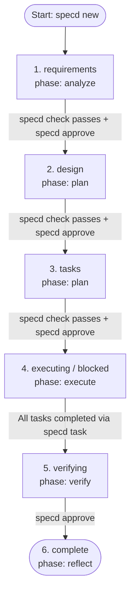
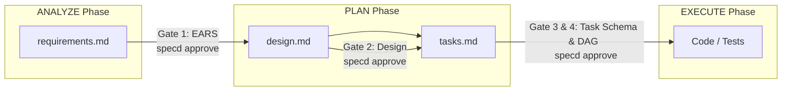

# specd User Guide

Welcome to the `specd` User Guide. This guide covers everything you need to know to use the `specd` coding harness in a target project. 

---

## 1. Getting Started

### Project Initialization
To start using `specd` in a repository, initialize it in your project root:
```sh
# Scaffolds the .specd/ structure and writes default templates
node /path/to/specd/dist/cli.js init
```
**Exit Code Transitions:**
* `0`: Initialization succeeded. The `.specd/` directory is created.
* `2`: CLI usage/argument error (e.g. invalid arguments).

### Creating a New Spec
A "spec" is a modular directory representing a single feature, task, or bugfix. Create a new spec using `new`:
```sh
node /path/to/specd/dist/cli.js new my-feature --title "Implement JWT Authentication"
```
This creates `.specd/specs/my-feature/` and populates the six standard Markdown stubs and an initial `state.json` file.
* **Exit code `0`**: Spec created successfully. Status set to `requirements`.
* **Exit code `3`**: Root `.specd/` folder not found (you must run `init` first).

---

## 2. The Spec Lifecycle

The development lifecycle consists of 5 main **phases**, driven by the spec's **status** machine. The planning ratchet restricts transitions between these phases to ensure that implementation never begins without clear requirements and design.

### Status and Phase Mapping

The CLI derives the current active phase from the spec's status:

| Spec Status (`state.json`) | Derived Phase (`phase`) | Primary Activities |
|---|---|---|
| `requirements` | `analyze` | Authoring and linting user story and criteria in `requirements.md`. |
| `design` | `plan` | Specifying component architecture, interfaces, and testing strategies in `design.md`. |
| `tasks` | `plan` | Defining the execution waves and tasks in `tasks.md`. |
| `executing` | `execute` | Implementing the tasks in sequence. |
| `blocked` | `execute` | Execution halted; all remaining runnable tasks are blocked. |
| `verifying` | `verify` | Running overall verification; preparing for human sign-off. |
| `complete` | `reflect` | Spec closed. Memories promoted; final reports generated. |

### Lifecycle Flowchart



---

## 3. Writing Spec Artifacts

The core philosophy of `specd` is that **intent lives in Markdown, status lives in state.json**. You must author files according to strict structural guidelines.

### 1. `requirements.md` (Analyze Phase)
Requirements must conform to the **EARS (Easy Approach to Requirements Syntax)** grammar. The `specd check` command runs a regex-based requirements linter to verify compliance.

#### EARS Syntax Rules:
*   **Ubiquitous** (Always active): `THE SYSTEM SHALL <response>`
*   **Event-driven** (Triggered by event): `WHEN <trigger> THE SYSTEM SHALL <response>`
*   **State-driven** (Active while in a state): `WHILE <state> THE SYSTEM SHALL <response>`
*   **Optional-feature** (Active if feature present): `WHERE <feature> THE SYSTEM SHALL <response>`
*   **Unwanted** (Error/exceptional case): `IF <condition> THEN THE SYSTEM SHALL <response>`

#### Template & Example:
Every requirement must contain a `**User story:**` block and a numbered list of `**Acceptance criteria:**` using the EARS patterns.

```markdown
# Requirements — JWT Authentication

## REQ-001 — Token Issuance
**User story:** As an API client, I want to authenticate with credentials so I can obtain a secure JWT.

**Acceptance criteria:**
1. WHEN a user submits valid credentials to /login THE SYSTEM SHALL return an HTTP 200 with a JWT.
2. IF a user submits invalid credentials THEN THE SYSTEM SHALL return an HTTP 401 Unauthorized.
```

---

### 2. `design.md` (Plan Phase)
The design document details how the requirements will be implemented. The Design Gate enforces that all **7 mandatory H2 headers** are present, non-empty, and free of `TODO` placeholders:

```markdown
# Design — JWT Authentication

## Overview
High level description of the JWT implementation.

## Architecture
How authentication fits into the application structure.

## Components and interfaces
Signatures and file locations for the login handler, token issuer, and validation middleware.

## Data models
The structure of user objects and payload structure of the JWT claims.

## Error handling
Exceptional scenarios (expired tokens, malformed signatures, database outages).

## Verification strategy
Unit tests for handlers and cryptographic routines; E2E tests for login flow.

## Risks and open questions
Security risks (token storage) and performance considerations.
```

---

### 3. `tasks.md` (Plan Phase)
Tasks are defined as Markdown checklist items grouped under `## Wave N` headers (where `N` represents concurrent execution waves, starting at `1`).

Each task has a checklist item followed by a list of metadata keys indented with spaces:
*   `why`: The architectural reason for this task.
*   `role`: The persona required (`investigator`, `builder`, `reviewer`, `verifier`).
*   `files`: Comma-separated files modified or researched.
*   `contract`: The technical signature or behavior contract.
*   `acceptance`: Test or user criteria that determines completion.
*   `verify`: Shell command to verify this specific task.
*   `depends`: Comma-separated IDs of tasks that must complete first, or `—`.
*   `requirements` (optional): Comma-separated requirement numbers (e.g. `1, 2`).

#### Tasks Template:
```markdown
# Tasks — JWT Authentication

## Wave 1
- [ ] T1 — Create token generation utility
  - why: Foundations for issuing tokens
  - role: builder
  - files: src/utils/jwt.ts, test/utils/jwt.test.ts
  - contract: generateToken(payload: object) => string
  - acceptance: Generates valid HS256 JWTs with 1-hour expiration
  - verify: npm test test/utils/jwt.test.ts
  - depends: —
  - requirements: 1

## Wave 2
- [ ] T2 — Login route handler
  - why: Expose authentication interface
  - role: builder
  - files: src/routes/auth.ts, test/routes/auth.test.ts
  - contract: POST /login routes to handler
  - acceptance: Returns token on 200; handles incorrect passwords
  - verify: npm test test/routes/auth.test.ts
  - depends: T1
  - requirements: 1, 2
```

---

## 4. Checkbox vs JSON Sync Comparison

When tasks are executing, the CLI acts as the dual-writer, keeping the Markdown checklists (`tasks.md`) in sync with the machine state (`state.json`). **Do not hand-edit state.json or manually check markdown boxes.**

Here is how task states align side-by-side:

| `tasks.md` Markdown representation | `state.json` Status | Interpretation |
|---|---|---|
| `- [ ] T1 — Create token ...` | `"status": "pending"` | Dependency not cleared or task not yet started. |
| `- [/] T1 — Create token ...` | `"status": "running"` | Work on this task has been initiated. |
| `- [x] T1 — Create token ...` <br/> `<!-- verified: npm test ... (Commit: abc1234) -->` | `"status": "complete"` | Task complete. Evidence is recorded in the HTML comment. |
| `- [!] T1 — Create token ...` <br/> `<!-- blocker: DB unavailable -->` | `"status": "blocked"` | Task blocked. Blocker reason annotated. |

---

## 5. The Planning Ratchet & Phase Transitions

To prevent skipping process steps, the CLI enforces a planning ratchet using `check` and `approve`.



### Checking Validation Gates
The `specd check` command runs 7 strict verification checks:
```sh
node /path/to/specd/dist/cli.js check my-feature
```
**Exit Code Transitions:**
* `0`: All gates passed.
* `1`: One or more validation checks failed (e.g. invalid EARS grammar, missing design header, cycle in task dependencies).
* `3`: Target spec slug not found.

### Approving Transitions
Once `check` passes, advance to the next planning phase:
```sh
node /path/to/specd/dist/cli.js approve my-feature
```
**Exit Code Transitions:**
* `0`: Phase advanced successfully.
* `1`: Advance blocked because validation gates failed.

---

## 6. Task Execution Commands

Once the spec enters the `executing` status, the agent works on tasks.

### 1. Identify the Next Task
The agent runs `next` to find out what to do next:
```sh
node /path/to/specd/dist/cli.js next my-feature
```
This returns the single next runnable task (lowest wave, then lowest ID) packaged as a instructions block for the agent.

To view the entire concurrent runnable frontier (all tasks with cleared dependencies):
```sh
node /path/to/specd/dist/cli.js next my-feature --all
```
**Exit Code Transitions:**
* `0`: Found runnable task(s).
* `1`: Blocked by active planning gates (cannot execute tasks if spec status is still `design`).

For **parallel orchestration**, `dispatch` emits a ready-to-run packet per frontier task — each bundles the resolved role prompt, contract, files, acceptance, verify command, and the exact completion command, so an orchestrator can fan the frontier out to parallel subagents with zero assembly:
```sh
node /path/to/specd/dist/cli.js dispatch my-feature --json
```

### 2. Verifying a Task (the completion proof)
`specd` does **not** trust a free-text "tests passed" claim. Instead, it runs the task's own `verify:` command for you and records the result. After implementing the task, run:
```sh
node /path/to/specd/dist/cli.js verify my-feature T1
```
This spawns the task's `verify:` shell command in the repo root, captures the OS **exit code**, output tails, duration, and the current **git HEAD**, and writes a `verification` record into `state.json`:
* **Exit code `0`**: Command passed (`verified: true`). The task is now completable.
* **Exit code `1`**: Command failed or timed out (`verified: false`). Fix the code and re-run.

> The per-run timeout is `SPECD_VERIFY_TIMEOUT_MS` (default 600s). A timed-out run is recorded as failed with exit `124`.

### 3. Updating Task Status
To start a task:
```sh
node /path/to/specd/dist/cli.js task my-feature T1 --status running
```
To **complete** a task — all dependencies must be `complete` **and** a passing `specd verify` record must exist whose command still matches the current `verify:` line:
```sh
node /path/to/specd/dist/cli.js task my-feature T1 --status complete
```
You may pass `--evidence "..."` to override the auto-derived proof string. For **read-only roles** (investigator/reviewer) whose `verify` is `N/A`, or genuinely manual proofs, use the escape hatch:
```sh
node /path/to/specd/dist/cli.js task my-feature T1 --status complete --unverified --evidence "Reviewed diff; no issues. (Commit: 7da5fe2)"
```
To mark a task as blocked (requires providing a `--reason`):
```sh
node /path/to/specd/dist/cli.js task my-feature T1 --status blocked --reason "Underlying database client library lacks connection pooling support."
```
**Exit Code Transitions:**
* `0`: Task status updated and files synced successfully.
* `1`: Command rejected. Reasons include:
  * No passing `specd verify` record (and `--unverified` not supplied).
  * Verification is **stale** — the recorded command no longer matches the current `verify:` line; re-run `specd verify`.
  * `--unverified` supplied without `--evidence`.
  * Dependencies of the task are not yet `complete`.
  * Spec gate is `awaiting-approval` (pass `--force` to override).
  * Stale local state (concurrency CAS failure).
* `2`: Argument/usage error.
* `3`: Target spec or task ID not found.

---

## 7. Appending Spec Records

As specifications evolve during development, decisions, requirements updates, and learnings are logged.

### ADRs (Architectural Decision Records)
To log an architectural decision:
```sh
node /path/to/specd/dist/cli.js decision my-feature "Use jose instead of jsonwebtoken library for Edge runtime support"
```
This appends a structured ADR block to `decisions.md`.
* **Exit code `0`**: ADR recorded successfully.

### Mid-flight Requirement Updates
If requirements change while implementation is ongoing, log the update:
```sh
node /path/to/specd/dist/cli.js midreq my-feature "Support JWT authentication via Cookie header as fallback" --impact high --interpretation "Need to check both Authorization and Cookie headers" --changes "Update design.md interface sections and add task T3"
```
**Critical Rule**: An impact level of `high` or `critical` automatically freezes execution by placing the spec's state gate into `awaiting-approval`. Tasks cannot be updated until a human reviews the change and runs `specd approve`.

### Memory Add & Promotion
To record localized learnings:
```sh
node /path/to/specd/dist/cli.js memory my-feature add --key "jose-expiration" --pattern "JWT exp claim must be positive integer" --body "Ensure numeric validation is added to prevent string cast security issues" --source "T1" --criticality important
```
Promote local memories to global steering:
```sh
node /path/to/specd/dist/cli.js memory my-feature promote --key "jose-expiration"
```
* Note: Promotes automatically if the key has appeared in multiple specs (threshold tunable in `config.json`), or forces promotion with `--force`.

---

## 8. Status and Reports

To view the CLI's progress and status dashboard:
```sh
node /path/to/specd/dist/cli.js status my-feature
```
To view the wave graph, critical paths, and active blockers:
```sh
node /path/to/specd/dist/cli.js waves my-feature
```
To generate a comprehensive Markdown or self-contained HTML report snapshot:
```sh
node /path/to/specd/dist/cli.js report my-feature --format html --out report.html
```

---

## 9. Spec-Level Acceptance (Optional)

When `config.gates.acceptance` is set to `required`, closing a spec (`verifying` → `complete`) demands a passing proof for **every** acceptance criterion. Record each proof with the criterion form of `verify`:
```sh
# Mark requirement 1, criterion 2 as passing, with mandatory evidence
node /path/to/specd/dist/cli.js verify my-feature --criterion 1.2 --status pass --evidence "E2E login test green; see CI run #481"
```
* Exit `0` for `pass`, `1` for `fail`. The requirement number must exist in `requirements.md`.
* With the gate `required`, `specd approve` refuses to close the spec while any requirement lacks a passing criterion or any criterion is recorded `fail`.
* Default is `off` — semantic sign-off is then purely the human running `specd approve` on the `verifying` spec.

---

## 10. Cross-Spec Programs

For multi-spec efforts, declare dependencies **between** specs and ask which whole specs are runnable now:
```sh
# Declare that the 'api' spec depends on the 'auth' spec being complete
node /path/to/specd/dist/cli.js program link api --on auth

# Render the program-level DAG: waves, runnable frontier, critical path, cycles
node /path/to/specd/dist/cli.js program
```
Edges are stored in `.specd/program.json`. Self-edges and edges that would create a cycle are rejected. Remove an edge with `program unlink api --on auth`.

---

## 11. Environment Variables & Troubleshooting

| Variable | Default | Effect |
|---|---|---|
| `SPECD_LOCK_TIMEOUT_MS` | `5000` | Max wait to acquire a spec's advisory lock before failing with a contention error. |
| `SPECD_LOCK_STALE_MS` | `30000` | Age past which an orphaned `.lock` file is reclaimed automatically. |
| `SPECD_VERIFY_TIMEOUT_MS` | `600000` | Per-run timeout for `specd verify`; a timed-out run records `verified: false` (exit `124`). |

### Common Errors
| Symptom | Cause & Fix |
|---|---|
| `--status complete requires a passing specd verify` | No verify record. Run `specd verify <slug> <id>` first, or use `--unverified --evidence` for read-only/manual tasks. |
| `verification is stale` | The `verify:` line changed since the record was made. Re-run `specd verify <slug> <id>`. |
| `spec is gated (awaiting-approval)` | A `high`/`critical` `midreq` froze the spec. Present the revised plan, then `specd approve`. |
| `exit 3` on any command | `.specd/` root or the spec slug was not found — run `init`/`new`, or run from inside the target repo. |
| `dependency cycle` / `depends on missing task` | A `tasks.md` DAG error. Fix `depends:` keys; `specd check` and `specd waves` pinpoint the offending IDs. |
| CAS / revision write abort (`exit 1`) | Concurrent write clobber prevented. Re-read state and retry the mutation. |
